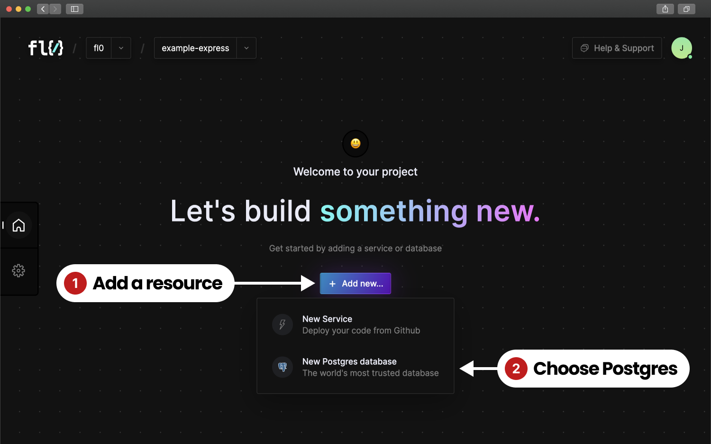
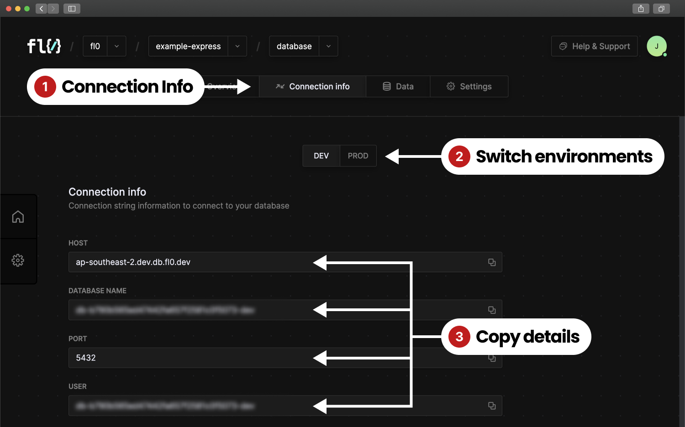

# Databases

### Creating a new database

1. From the Project homepage, click on the "Add new button"
2. Select the database type. Currently FL0 supports Postgres

<figure><figcaption></figcaption></figure>

### Connecting to the database

Once a database has been provisioned it will appear on your Project homepage. You can connect to it from a desktop client like [PGAdmin](https://www.pgadmin.org/) or from your code. Click on the database to open up its details and follow the steps below:

1. Click on the Connection Info tab
2. Switch to the correct environment
3. Copy the connection information and paste it into your client or code

<figure><figcaption></figcaption></figure>

For instructions on how to connect with specific database client libraries, see the [Database](../database/) section.
