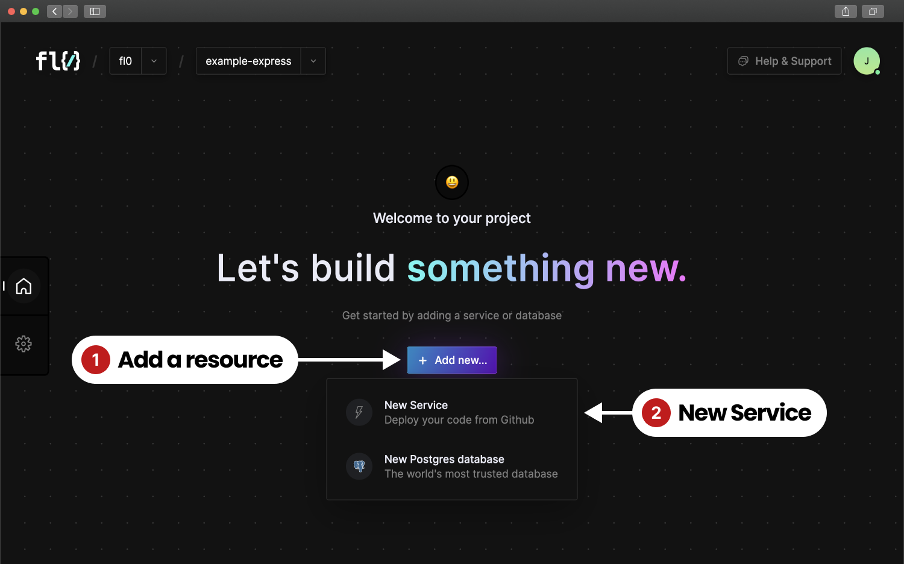
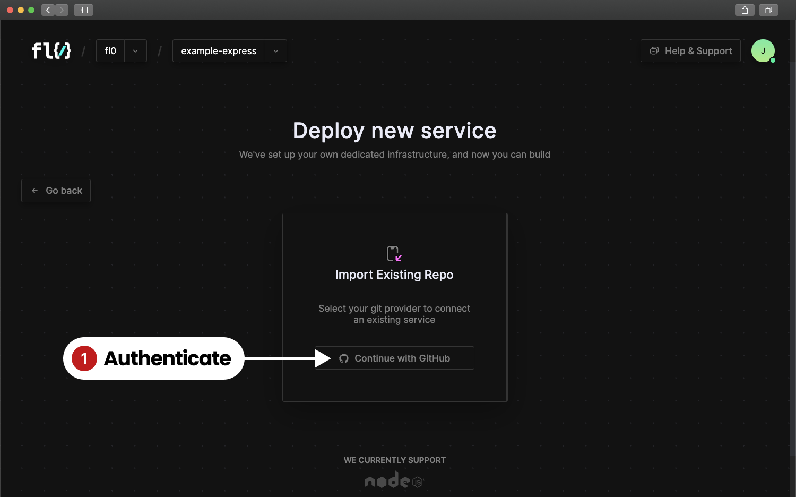

# Services

### Service Requirements

For your codebase to run in a FL0 service, it needs to meet the following requirements:

1. Compatible with Node v18.12.1
2. Contains a `package.json` file with a `start` command that runs a NodeJS server
3. If your project has a `build` command, the output folder must be called `dist`
4. Listens on a port specified by `process.env.PORT`&#x20;

### Creating a new service

From the Project Homepage

1. Click the "Add New" button
2. Choose "Service" from the dropdown menu

<figure><figcaption></figcaption></figure>

If FL0 isn't connected to your Github organization yet, follow the prompts to install the FL0 Github app and grant permissions to the necessary repos.

<figure><figcaption></figcaption></figure>

