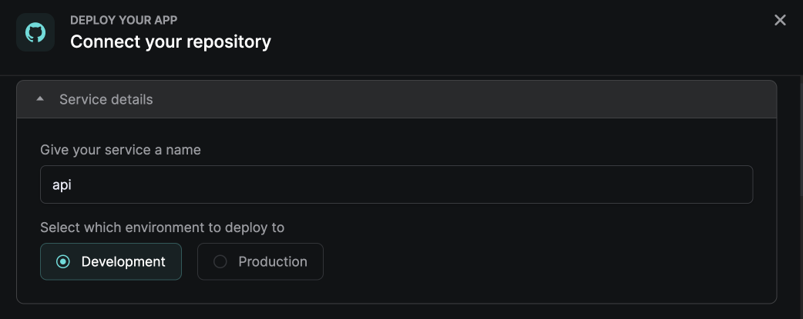
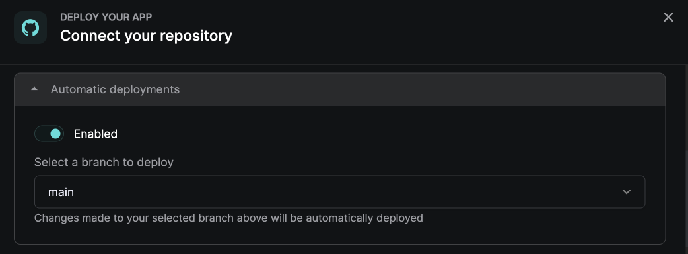
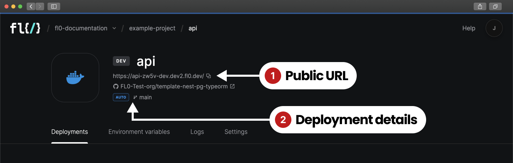

# Apps

With FL0 you can take your code and turn it into a working app, deployed as containers in our fully managed infrastructure.&#x20;

Apps can provide REST or GraphQL APIs, run scheduled jobs, perform batch processing or any other kind of backend processes.

### Creating Apps

#### Requirements

In order to create an app in FL0, you must have the following:

1. Your code stored in a Github repository
2. Admin permissions to the Github organization
3. A Dockerfile in the root of your repository

#### Connecting to Github

See the section on [Connecting a Workspace to Github](workspaces.md#connecting-a-workspace-to-github).

#### Naming the App

The name you give your app will become part of the hostname of the app. See the section on [Using the App](apps.md#using-the-app) for more information.

<figure><figcaption><p>Naming the app and choosing an environment.</p></figcaption></figure>

#### Selecting an Environment

When you first create an app, choose the environment to which it should be deployed. In most cases, apps should be deployed to Development first, and promoted to Production later.

#### Automatic vs Manual Deployments

By default, FL0 is configured to automatically deploy the latest version your app whenever a commit is pushed to your chosen branch. You can also choose to manually deploy your code based on a nominated branch or commit hash.

<figure><figcaption><p>Configuring auto or manual deployments</p></figcaption></figure>

#### Configuring Environment Variables

See the section below on [Environment Variables](apps.md#environment-variables).

### Using the App

Every app is given a unique URL that is comprised of the following elements:

```
https://{{app-name}}-{{unique-identifier}}-{{environment}}.fl0.io
```

1. `{{app-name}}` is the name you chose when creating the app
2. `{{unique-identifier}}` is a randomly generated 4 character string
3. `{{environment}}`  refers to the environment in which the app is deployed
   1. The same app will have a different URL in Development vs Production

Once successfully deployed, you can access your app using the URL found on the **App Overview** page.

<figure><figcaption><p>The App Overview page</p></figcaption></figure>

### Environment Variables

Environment variables are custom settings that can be passed into your app when FL0 builds and deploys it. These settings can have different values in Development and Production.


Any changes to Environment Variables will require your app to be redeployed. After you edit an Environment Variable, trigger a manual deployment or push a commit for the changes to take effect.


For more information, see the [Dockerfile reference.](https://docs.docker.com/engine/reference/builder/#env)

### Viewing Logs

Logs from the containers running your apps can be found on the **Logs** tab.

1. If multiple containers are running, you can select the instance (container) to view from the dropdown
2. You can download logs from a specific date range by clicking the **Download logs** button

### Scaling Apps

FL0 is configured to automatically scale the number of containers running your app depending on CPU and memory usage.&#x20;


###
